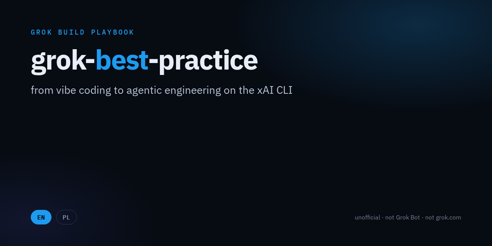
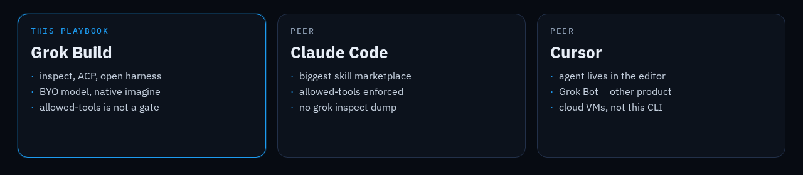

**Język:** [English](README.md) · **Polski**

<p align="center">
  
</p>

<p align="center">
  <a href="https://github.com/ralftester/grok-best-practice/stargazers"></a>
  
  
  
  <a href="https://x.ai/cli"></a>
  <a href="README.md"></a>
  <a href="README.pl.md"></a>
</p>

# grok-best-practice

**od klepania w czacie do inżynierii agentów na Grok Build**

Żywy kurs i mapa ekosystemu dla terminalowego agenta xAI. Skille, wtyczki, hooki, `AGENTS.md`, `grok inspect`, Plan Mode, headless, ACP.

> Nieoficjalny playbook społeczności. Bez afiliacji z xAI. **Grok Build ≠ Grok Bot ≠ grok.com chat.**

## Jak używać

```bash
curl -fsSL https://x.ai/cli/install.sh | bash   # macOS / Linux
# irm https://x.ai/cli/install.ps1 | iex        # Windows PowerShell

cd your-project
grok inspect
grok plugin install superpowers@xai-official --trust
grok
```

W TUI: `Use inspect-and-ship. Do not edit yet.`

Czytaj to jak kurs. Jedna paczka na raz. Nie wsypuj 292 skilli do `.grok/`.

## Spis treści

- [Koncepcje](#koncepcje)
- [Grok Build vs Claude Code vs Cursor](#grok-build-vs-claude-code-vs-cursor)
- [Workflowy](#workflowy)
- [Community](#community)
- [Ograniczenia](#ograniczenia)
- [Wskazówki](#wskazówki)
- [Contributing](#contributing)

## Koncepcje

| Funkcja | Lokalizacja | Uwagi |
|---------|-------------|-------|
| Instrukcje | `AGENTS.md`, `.grok/rules/` | Ładuje też `CLAUDE.md` jako kompat. Głębsza ścieżka wygrywa. |
| Skille | `.grok/skills/<name>/SKILL.md`, `~/.grok/skills/` | [best-practice/grok-skills.md](best-practice/grok-skills.md) |
| Wtyczki | `/marketplace`, `grok plugin install …` | [best-practice/grok-plugins.md](best-practice/grok-plugins.md) |
| Hooki | `.grok/hooks/`, `/hooks-trust` | Fail-open. [best-practice/grok-hooks.md](best-practice/grok-hooks.md) |
| Ignore | `.grokignore` | Plus pliki instrukcji pominięte przez gitignore. |
| Inspect | `grok inspect` / `--json` | [best-practice/grok-inspect.md](best-practice/grok-inspect.md) |
| Plan Mode | `/plan`, Shift+Tab | Brama na edycję plików. Bash nie jest zablokowany. [plan](best-practice/grok-plan-mode.md) |
| Subagenty | `.grok/agents/`, worktrees | [best-practice/grok-agents.md](best-practice/grok-agents.md) |
| Headless | `grok -p` | [best-practice/grok-headless.md](best-practice/grok-headless.md) |
| ACP | `grok agent stdio` | Tu podpinają się IDE / web UI. |
| Imagine | `/imagine`, `/imagine-video` | Native. Nie wtyczka. |
| Memory | `/memory`, `/flush` | GA od CLI 1.0.34. |
| Demo skill | [inspect-and-ship](.grok/skills/inspect-and-ship/SKILL.md) | Pierwsza sesja w tym repo. |

<p align="center">
  
</p>

## Grok Build vs Claude Code vs Cursor

Sprawdzone 2026-09-17 na [docs.x.ai/build](https://docs.x.ai/build/overview) i publicznych repo. Bez kopania konkurencji.

| | **Grok Build** | **Claude Code** | **Cursor** |
|---|---|---|---|
| Forma | Rust TUI, otwarty harness | Zamknięte CLI | IDE + agenty |
| Model | grok-4.6 + BYO | Najpierw Anthropic | Mieszane; Grok Bot to inny produkt |
| Skille | `SKILL.md`; **`allowed-tools` nie zamyka narzędzi** | `SKILL.md`; allowed-tools jest egzekwowane | Rules / plugins |
| Plan | Brama na edycję pliku planu; bash i subagenty nie są zablokowane | Plan + uprawnienia | Agent w edytorze |
| Inspect | `grok inspect` | Nie ma dumpa | Settings UI |
| IDE | ACP z pudełka | Własny protokół | Native |
| Unikalne | Inspect, ACP, imagine, X search, BYO | Wielkość marketplace, kultura ewaluacji | UX edytora, Grok Bot VM |
| To repo | Tak | Wskaźniki | Wskaźniki; Bot ≠ Build |

**Nie pisz „drop-in Claude”.** Grok *czyta* `.claude/skills`. Semantyki security Claude’a nie kopiuje.

## Workflowy

Playbooki z branży, żywe odznaki ★. Install pod Grok, gdy istnieje.

Pełna tabela: [catalog/workflows.md](catalog/workflows.md).

| Playbook | ★ | Na Grok |
|---|---|---|
| [Superpowers](https://github.com/obra/superpowers) | [](https://github.com/obra/superpowers) | `grok plugin install superpowers@xai-official --trust` |
| [Matt Pocock Skills](https://github.com/mattpocock/skills) | [](https://github.com/mattpocock/skills) | `npx skills add mattpocock/skills` potem `grok inspect` |
| [Addy Osmani agent-skills](https://github.com/addyosmani/agent-skills) | [](https://github.com/addyosmani/agent-skills) | `npx skills add addyosmani/agent-skills` |
| [Spec Kit](https://github.com/github/spec-kit) | [](https://github.com/github/spec-kit) | `uv tool install specify-cli` |
| [anthropics/skills](https://github.com/anthropics/skills) | [](https://github.com/anthropics/skills) | Loader kompatybilności |
| [xai-org/grok-build](https://github.com/xai-org/grok-build) | [](https://github.com/xai-org/grok-build) | Oficjalne CLI |

## Community

Tylko wpisy, które mówią do oficjalnego `grok`. Pełna lista: [catalog/community.md](catalog/community.md).

- [xai-org/grok-build](https://github.com/xai-org/grok-build) — harness.
- [DominikTobureto/awesome-grok-build](https://github.com/DominikTobureto/awesome-grok-build) — starter kit (ostatni push 2026-08-23; szacunek, CLI już poszedł dalej).
- [xintaofei/codeg](https://github.com/xintaofei/codeg) — GUI na ACP.
- [farion1231/cc-switch](https://github.com/farion1231/cc-switch) — przełącznik wielu CLI.
- [kenryu42/cc-safety-net](https://github.com/kenryu42/cc-safety-net) — strażnik PreToolUse.
- [superagent-ai/grok-cli](https://github.com/superagent-ai/grok-cli) — **nieoficjalny** agent API. Inny binary.

Grok Bot jest w [ZeroPointRepo/awesome-grok-bot](https://github.com/ZeroPointRepo/awesome-grok-bot). Inny produkt.

## Ograniczenia

1. `allowed-tools` w SKILL.md to nie granica bezpieczeństwa.
2. Plan Mode nie blokuje bash.
3. Hooki są fail-open (crash → tool i tak leci).
4. Pola `model` / `effort` w skillu są ignorowane.
5. Oficjalny harness nie bierze publicznych PR. Użyj `/feedback`.
6. Zrzuty YAML/`GROK.md` w stylu LifeJiggy się nie ładują. Workflowy Grok to `.rhai`.

## Wskazówki

Ze źródła. Nie „pro tipy”.

1. `grok inspect` zanim zaczniesz debugować brakujący skill. ([inspect](best-practice/grok-inspect.md))
2. Projektowym hookom dawaj zaufanie przez `/hooks-trust`, nie przez nadzieję, że SKILL.md Cię zasandboxuje. ([hooks](best-practice/grok-hooks.md))
3. Superpowers instaluj z marketplace xAI, potem inspect jeszcze raz. ([plugins](best-practice/grok-plugins.md))
4. Headless CI: `grok -p` + `--no-auto-update`. Kluczy nie dawaj na argv. ([headless](best-practice/grok-headless.md))
5. Jeden playbook na tydzień. 292 skille ECC to katalog, nie loadout. ([workflows](catalog/workflows.md))
6. Dokładny tekst na ekranie rób w HTML/kodzie, nie w `/imagine`. Native imagine jest do obrazków.
7. Nazwy produktów zostają po angielsku. Druga wersja: [README.md](README.md).

## Contributing

[CONTRIBUTING.md](CONTRIBUTING.md). Nowe wiersze muszą być o Grok Build, ze źródłem, bez gwiazdek wpisanych z palca.

## Licencja

Lista i docs: [CC BY 4.0](LICENSE). Nieoficjalne.

Jeśli to skróciło Ci dzień setupu, [daj gwiazdkę](https://github.com/ralftester/grok-best-practice/stargazers). Tego jednego prosimy.

[](https://www.star-history.com/#ralftester/grok-best-practice&Date)
